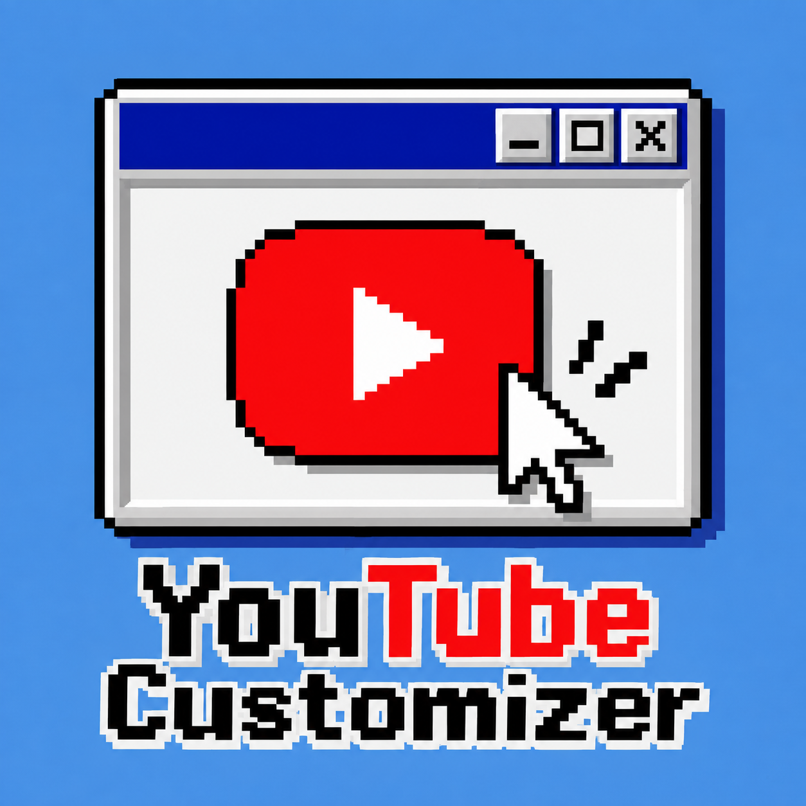

  
  <h1>🌸 YouTube Customizer</h1>
  
<strong>Make YouTube look and feel like your own.</strong>

  

    <kbd>🧩 Manifest V3</kbd>
    <kbd>🌐 Chrome</kbd>
    <kbd>🌐 Microsoft Edge</kbd>
    <kbd>🎨 Live preview</kbd>
  

> Customize YouTube's appearance, player, and layout. Changes are previewed on the current YouTube tab as you adjust the settings.

## ✨ Features at a glance

| Section | What you can customize |
| --- | --- |
| 🎨 **Appearance** | Page theme, colors, opacity, frosted glass, background images, GIFs, and silent MP4 videos |
| ▶️ **Player** | Progress and buffer colors, bar thickness, scrubber shape, and effects |
| 🧩 **Layout** | Video grid, hover previews, Shorts, sidebar, comments, and live chat |

### 🎨 Appearance

- Choose the **Charcoal**, **Light**, **Forest**, or **Windows Classic** theme, or set your own page, surface, text, and accent colors.
- Adjust UI opacity from 0–100% and frosted-glass blur from 0–30 px.
- Upload a background image, GIF, or MP4 video up to 20 MB, choose Fill or Fit, and adjust its opacity. Images can also be tiled. MP4 videos loop silently.
- YouTube ambient lighting is suppressed while a custom background is active.
- In theater mode (T), the empty space around the video reveals your wallpaper with the current UI blur setting.

### ▶️ Player

- Customize progress and buffered-segment colors, progress-bar thickness, and scrubber size.
- Choose a separate color for the **Most replayed** heatmap, including its gradient and outline.
- Choose a solid color, pulsing glow, moving shimmer, or cycling rainbow effect.
- Pick a built-in scrubber shape or upload a custom image or GIF.

### Audio

- Open the separate **Audio** tab to enable volume boost up to **500%**, adjust bass, midrange, treble, and stereo balance, and optionally reduce clipping. Audio processing starts off; disabling it restores normal audio. Wallpaper and thumbnail previews are excluded.
- **Reset tab** on Audio resets audio settings independently from Player and Appearance.

### 🧩 Layout and browsing

- Set Home videos and Shorts to 2–6 items per row, with fewer columns on narrow windows. Disable hover previews or reduce motion.
- Home Shorts initially show one row. Show more reveals the additional cards; changing the column setting collapses the shelf again.
- Library pages use rounded panels and cards with the shared theme background, opacity, and blur: History, Playlists, Watch later, Liked videos, Downloads, Courses, and Clips.
- Hide Shorts, the topic filter bar, the Create button, or the notifications button.
- Independently hide Subscriptions, You, Explore, More from YouTube, and Report history in the sidebar.
- Adjust related-video thumbnail width, or hide related videos, comments, or live chat.

## 🚀 Installation

YouTube Customizer is a Manifest V3 extension for Chromium-based browsers, including Google Chrome and Microsoft Edge.

1. Download or clone this project and extract it to a folder on your computer.
2. Open the extensions page: enter `chrome://extensions` in Chrome or `edge://extensions` in Edge.
3. Turn on **Developer mode**.
4. Select **Load unpacked**.
5. Choose the project root folder containing `manifest.json`.
6. Open YouTube. You can pin YouTube Customizer from the browser's Extensions menu for quick access.

## 🪄 Getting started

1. Open YouTube and click the extension icon in the browser toolbar.
2. In **Appearance**, enable **Enable page theme**, choose a theme, and adjust its colors, opacity, or blur.
3. In **Wallpaper**, upload a background image, GIF, or MP4 video. In **Player**, customize the progress bar and scrubber.
4. In **Audio**, enable volume boost and adjust the equalizer or stereo balance.
5. In **Layout**, hide page elements or adjust the video layout as needed.
6. Changes are previewed live and saved automatically. Use **Reset tab** to reset the current settings section, or **Reset all** to restore the default settings.

## 🖼️ Backgrounds and settings storage

- Backgrounds support PNG, JPEG, WebP, AVIF, GIF, and MP4 up to **20 MB** per file. GIF animation is preserved; MP4 videos loop with sound permanently muted.
- Custom scrubber icons support PNG, JPEG, WebP, AVIF, and GIF up to **5 MB**.
- The `unlimitedStorage` permission lets the extension save 20 MB backgrounds after they are encoded for browser storage.
- Theme and layout settings are stored in browser sync storage. Whether they sync across devices depends on your browser account's sync settings.
- Uploaded backgrounds and custom scrubber images are stored locally in the current browser and do not sync with your settings.

## 🔄 Updating

After changing or updating the project files, open the browser's extensions page and click the extension's **Reload** button. Then refresh any open YouTube tabs.

  
🛠️ Frequently asked questions

  **Settings are not being applied to YouTube.**

  Make sure the active tab is open to YouTube. After reloading the extension, refresh the YouTube page.

  **My background image did not sync to another browser.**

  Backgrounds and custom scrubber images are stored locally. Theme and layout settings are the items saved to browser sync storage.

  **How do I undo my changes?**

  Use **Reset tab** to reset the current settings section, or **Reset all** to restore all default settings.

## 📁 Project structure

| File / folder | Purpose |
| --- | --- |
| `assets/logo.png` | Original project logo |
| `icons/` | Extension icons derived from the logo at 16, 32, 48, and 128 px |
| `manifest.json` | Extension metadata, icons, permissions, and content-script configuration |
| `settings.js` | Default settings, validation, and theme presets |
| `popup.html`, `popup.css`, `popup.js` | Extension settings popup |
| `yt.js`, `content/` | YouTube page styling and feature controllers |
| `content/home-shorts-grid.js` | Homepage Shorts columns; updates on shelf structure changes and detaches outside Home |
| `content/audio-controller.js` | Player volume boost and equalizer; native Web Audio nodes with normal-audio bypass |
| `tests/` | Regression and browser smoke-test scripts |

  🌸 Add a little of your own style to YouTube.

